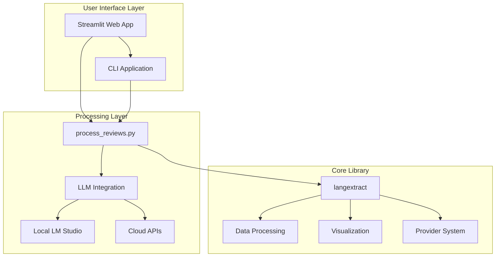

# LangExtract Project Documentation

## 📋 Table of Contents

1. [Project Overview](#project-overview)
2. [Architecture](#architecture)
3. [Core Components](#core-components)
4. [Installation Guide](#installation-guide)
5. [Usage Examples](#usage-examples)
6. [API Reference](#api-reference)
7. [Custom Applications](#custom-applications)
8. [Development Guide](#development-guide)
9. [Testing](#testing)
10. [Troubleshooting](#troubleshooting)

## 🎯 Project Overview

LangExtract is a powerful Python library that leverages Large Language Models (LLMs) to extract structured information from unstructured text documents. This repository contains both the core library and custom review analysis applications built on top of it.

### Key Features

- **Precise Source Grounding**: Maps every extraction to its exact location in source text
- **Reliable Structured Outputs**: Enforces consistent output schema based on few-shot examples
- **Long Document Optimization**: Handles large documents through chunking and parallel processing
- **Interactive Visualization**: Generates self-contained HTML files for reviewing extractions
- **Flexible LLM Support**: Works with cloud-based (Gemini, OpenAI) and local models (Ollama)
- **Domain Adaptability**: Define extraction tasks for any domain using examples

### Project Structure

```
langextract/
├── Core Library (from upstream)
│   ├── langextract/          # Core library code (deleted in this repo)
│   ├── tests/                # Test suite (deleted in this repo)
│   └── docs/                 # Documentation (deleted in this repo)
│
├── Custom Applications
│   ├── streamlit_review_app.py    # Interactive Streamlit UI for review analysis
│   ├── process_reviews.py         # Backend logic for review processing
│   └── review_app.py              # Command-line review processor
│
├── Configuration
│   ├── requirements.txt      # Python dependencies
│   ├── README.md             # Main library documentation
│   └── README_STREAMLIT_APP.md    # Streamlit app documentation
│
└── Data
    ├── all_reviews.csv       # Sample review data
    └── extraction_results.jsonl   # Processed results
```

## 🏗️ Architecture

### System Architecture



### Data Flow

1. **Input**: CSV file with review data
2. **Column Mapping**: User maps CSV columns to required fields
3. **LLM Processing**: Reviews analyzed for sentiment and problems
4. **Output Generation**: Results saved as CSV with classifications
5. **Visualization**: Interactive dashboards and analytics

## 🔧 Core Components

### 1. Streamlit Review App (`streamlit_review_app.py`)

Interactive web interface for review analysis with features:

- **File Upload**: Drag-and-drop CSV upload
- **Auto-Mapping**: AI-powered column detection
- **Progress Tracking**: Real-time processing status
- **Analytics Dashboard**: Visual insights with charts
- **Export Options**: Download processed results

Key Functions:
- `initialize_session_state()`: Session management
- `process_reviews_batch()`: Batch processing orchestration
- `match_csv_fields_to_analysis_fields()`: AI column mapping
- `create_analytics_dashboard()`: Interactive visualizations

### 2. Process Reviews Module (`process_reviews.py`)

Backend logic for LLM-based review analysis:

- **Sentiment Analysis**: Positive/Negative/Neutral classification
- **Problem Extraction**: Identifies and categorizes issues
- **LLM Integration**: Supports multiple LLM providers
- **Error Handling**: Robust error recovery

Key Functions:
- `create_extraction_config()`: Generates LLM prompts
- `analyze_review_with_llm()`: Single review analysis
- `get_valid_problem_categories()`: Default category list

### 3. Command-Line Interface (`review_app.py`)

Standalone CLI for batch processing:

- **Batch Processing**: Process entire CSV files
- **Flexible Configuration**: Command-line arguments
- **Progress Reporting**: Console-based progress tracking

## 📦 Installation Guide

### Prerequisites

- Python 3.8 or higher
- pip package manager
- Virtual environment (recommended)
- LM Studio (for local LLM inference)

### Step-by-Step Installation

1. **Clone Repository**
   ```bash
   git clone https://github.com/google/langextract.git
   cd langextract
   ```

2. **Create Virtual Environment**
   ```bash
   python3 -m venv .venv
   source .venv/bin/activate  # On Windows: .venv\Scripts\activate
   ```

3. **Install Dependencies**
   ```bash
   pip install -r requirements.txt
   ```

4. **Install LangExtract Library**
   ```bash
   pip install langextract
   # Or for development:
   pip install -e .
   ```

5. **Setup LM Studio** (for local inference)
   - Download from [lmstudio.ai](https://lmstudio.ai/)
   - Install and download a model (e.g., gemma2:2b)
   - Start the API server on port 1234

## 🚀 Usage Examples

### Basic Review Analysis

```python
from process_reviews import analyze_review_with_llm, create_extraction_config

# Configure the extraction
prompt = create_extraction_config(
    valid_categories=["Fit", "Comfort", "Price"],
    model_id="gemma2:2b",
    temperature=0.0
)

# Analyze a review
sentiment, problems = analyze_review_with_llm(
    review_text="The shoes are comfortable but too expensive",
    rating=3,
    prompt=prompt,
    model_config={"model_id": "gemma2:2b", "temperature": 0.0}
)

print(f"Sentiment: {sentiment}")
print(f"Problems: {problems}")
```

### Using LangExtract Core Library

```python
import langextract as lx

# Define extraction task
prompt = "Extract product features and issues from reviews"

# Create examples
examples = [
    lx.data.ExampleData(
        text="The battery life is excellent but the screen is dim",
        extractions=[
            lx.data.Extraction(
                extraction_class="feature",
                extraction_text="battery life is excellent",
                attributes={"type": "positive"}
            ),
            lx.data.Extraction(
                extraction_class="issue",
                extraction_text="screen is dim",
                attributes={"type": "negative"}
            )
        ]
    )
]

# Run extraction
result = lx.extract(
    text_or_documents="Great product with minor issues...",
    prompt_description=prompt,
    examples=examples,
    model_id="gemini-2.5-flash"
)
```

### Running the Streamlit App

```bash
# Start the app
streamlit run streamlit_review_app.py

# The app will open at http://localhost:8501
```

## 📚 API Reference

### Core Functions

#### `create_extraction_config(valid_categories, model_id, temperature)`

Creates a prompt configuration for LLM analysis.

**Parameters:**
- `valid_categories` (List[str]): List of problem categories
- `model_id` (str): LLM model identifier
- `temperature` (float): Model temperature (0.0-1.0)

**Returns:**
- `str`: Formatted prompt for LLM

#### `analyze_review_with_llm(review_text, rating, prompt, model_config)`

Analyzes a single review using LLM.

**Parameters:**
- `review_text` (str): Review content
- `rating` (Any): Numeric rating
- `prompt` (str): LLM prompt
- `model_config` (Dict): Model configuration

**Returns:**
- `Tuple[str, List[str]]`: (sentiment, problems_list)

### Streamlit App Functions

#### `process_reviews_batch(df, column_mapping, problem_categories, model_config, max_rows)`

Processes multiple reviews in batch.

**Parameters:**
- `df` (pd.DataFrame): Input dataframe
- `column_mapping` (dict): Column name mappings
- `problem_categories` (list): Valid problem categories
- `model_config` (dict): LLM configuration
- `max_rows` (Optional[int]): Maximum rows to process

**Returns:**
- `Tuple[List, List]`: (results, errors)

## 🎨 Custom Applications

### Review Analysis Dashboard

The Streamlit app provides an interactive dashboard with:

1. **Data Upload Section**
   - CSV file upload
   - Data preview
   - Automatic encoding detection

2. **Column Mapping**
   - AI-powered auto-mapping
   - Manual column selection
   - Validation checks

3. **Problem Categories**
   - Customizable categories
   - Default templates
   - Category management

4. **Processing Options**
   - Test runs on samples
   - Full dataset processing
   - Progress monitoring

5. **Analytics Dashboard**
   - Time-series charts
   - Sentiment analysis
   - Problem distribution
   - Product filtering

### Command-Line Processing

For batch processing without UI:

```bash
python review_app.py \
    --input all_reviews.csv \
    --output results.csv \
    --model gemma2:2b \
    --categories "Fit,Comfort,Price"
```

## 🛠️ Development Guide

### Setting Up Development Environment

1. **Install Development Dependencies**
   ```bash
   pip install -e ".[dev]"
   ```

2. **Code Formatting**
   ```bash
   # Auto-format code
   ./autoformat.sh
   
   # Or manually
   isort langextract tests --profile google --line-length 80
   pyink langextract tests --config pyproject.toml
   ```

3. **Pre-commit Hooks**
   ```bash
   pre-commit install
   pre-commit run --all-files
   ```

### Adding New Features

1. **Create Feature Branch**
   ```bash
   git checkout -b feature/your-feature
   ```

2. **Implement Changes**
   - Follow existing code patterns
   - Add tests for new functionality
   - Update documentation

3. **Run Tests**
   ```bash
   pytest tests/
   ```

4. **Submit Pull Request**
   - Include clear description
   - Reference any issues
   - Ensure CI passes

## 🧪 Testing

### Running Tests

```bash
# Run all tests
pytest tests/

# Run specific test file
pytest tests/test_specific.py

# Run with coverage
pytest --cov=langextract tests/

# Run integration tests
tox -e ollama-integration
```

### Test Structure

- Unit tests for core functions
- Integration tests for LLM providers
- End-to-end tests for applications
- Performance benchmarks

## 🔍 Troubleshooting

### Common Issues

#### LM Studio Connection Error

**Problem**: "Failed to connect to LLM provider"

**Solution**:
1. Verify LM Studio is running
2. Check server is started on port 1234
3. Ensure model is loaded
4. Test connection: `curl http://localhost:1234/v1/models`

#### Memory Issues

**Problem**: Out of memory errors with large datasets

**Solution**:
1. Use smaller batch sizes
2. Enable test mode first
3. Reduce model size
4. Increase system RAM

#### CSV Encoding Issues

**Problem**: Unicode decode errors

**Solution**:
1. Save CSV as UTF-8
2. Remove special characters
3. Use pandas encoding detection

#### Slow Processing

**Problem**: Analysis takes too long

**Solution**:
1. Use smaller models (7B vs 70B)
2. Reduce temperature to 0.0
3. Process in batches
4. Enable parallel processing

### Debug Mode

Enable detailed logging:

```python
import logging
logging.basicConfig(level=logging.DEBUG)
```

### Performance Optimization

1. **Model Selection**
   - Smaller models: Faster but less accurate
   - Larger models: Better quality but slower

2. **Batch Processing**
   - Optimal batch size: 10-50 reviews
   - Memory vs speed trade-off

3. **Caching**
   - Enable result caching
   - Reuse processed data

## 📄 License

This project is licensed under the Apache License 2.0. See [LICENSE](LICENSE) file for details.

For health-related applications, use is also subject to the [Health AI Developer Foundations Terms of Use](https://developers.google.com/health-ai-developer-foundations/terms).

## 🤝 Contributing

Contributions are welcome! Please see [CONTRIBUTING.md](CONTRIBUTING.md) for guidelines.

## 🔗 Resources

- [LangExtract GitHub](https://github.com/google/langextract)
- [LM Studio](https://lmstudio.ai/)
- [Streamlit Documentation](https://docs.streamlit.io/)
- [Google AI Studio](https://aistudio.google.com/)

---

**Happy Extracting! 🎉**