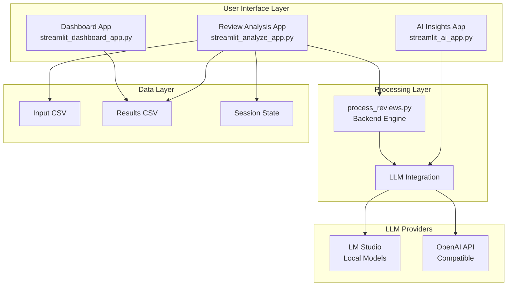

# Review Analysis V2 - Project Documentation

## 📋 Table of Contents

1. [Project Overview](#project-overview)
2. [Architecture](#architecture)
3. [Core Components](#core-components)
4. [Installation Guide](#installation-guide)
5. [Configuration](#configuration)
6. [Usage Guide](#usage-guide)
7. [Data Formats](#data-formats)
8. [API Reference](#api-reference)
9. [Troubleshooting](#troubleshooting)
10. [Development Guide](#development-guide)

## 🎯 Project Overview

Review Analysis V2 is a comprehensive customer review analysis system that uses Large Language Models (LLMs) to extract insights from product reviews. The system provides sentiment analysis, problem categorization, and positive feature identification through an intuitive Streamlit interface.

### Key Features

- **AI-Powered Column Matching**: Automatically maps CSV columns to required fields
- **Flexible LLM Support**: Works with LM Studio (local) or any OpenAI-compatible API
- **Multi-App Architecture**: Separate apps for review analysis and AI insights
- **Robust Error Handling**: Processes 100% of reviews with graceful error recovery
- **Real-time Processing**: Progress tracking with batch processing support
- **Interactive Dashboards**: Visual analytics with filtering and export options
- **No Hard-Coded Defaults**: All models configured through environment variables

### Project Structure

```
Review_Analysis_V2/
├── Applications
│   ├── streamlit_analyze_app.py   # Main review analysis interface
│   ├── streamlit_dashboard_app.py # Business insights dashboard
│   ├── process_reviews.py         # Backend LLM processing engine
│   └── streamlit_ai_app.py        # AI-powered insights generator
│
├── Configuration
│   ├── .env                       # LLM and API configuration
│   ├── requirements.txt           # Python dependencies
│   └── .streamlit/config.toml    # Streamlit configuration
│
├── Documentation
│   ├── README.md                  # Quick start guide
│   ├── ENV_VARIABLES.md          # Environment configuration guide
│   ├── CSV_FORMAT.md             # Data format specifications
│   ├── API_REFERENCE.md          # API documentation
│   └── PROJECT_DOCUMENTATION.md  # This file
│
└── Data (gitignored)
    ├── *.csv                      # Input review files
    └── *_results.csv              # Processed output files
```

## 🏗️ Architecture

### System Architecture


```mermaid
graph TB
    subgraph "User Interface Layer"
        A[Review Analysis App<br/>streamlit_analyze_app.py] 
        B[Dashboard App<br/>streamlit_dashboard_app.py]
        C[AI Insights App<br/>streamlit_ai_app.py]
    end
    
    subgraph "Processing Layer"
        D[process_reviews.py<br/>Backend Engine]
        E[LLM Integration]
    end
    
    subgraph "LLM Providers"
        F[LM Studio<br/>Local Models]
        G[OpenAI API<br/>Compatible]
    end
    
    subgraph "Data Layer"
        H[Input CSV]
        I[Results CSV]
        J[Session State]
    end
    
    A --> D
    C --> E
    D --> E
    E --> F
    E --> G
    A --> H
    A --> I
    B --> I
    A --> J
```

### Data Flow

1. **Input Stage**: User uploads CSV with review data
2. **Column Mapping**: AI automatically maps or user manually selects columns
3. **Model Selection**: Auto-selects from available LM Studio models or uses .env configuration
4. **Processing**: Reviews analyzed for sentiment and categorized problems/positives
5. **Output**: Results saved as enhanced CSV with all classifications
6. **Analytics**: Interactive dashboards display insights and trends

## 🔧 Core Components

### 1. Review Analysis App (`streamlit_analyze_app.py`)

Main interface for processing customer reviews with AI-powered analysis.

**Key Features:**
- Drag-and-drop CSV upload with encoding detection
- AI column matching using LLM (no fallback mapping)
- Model auto-selection from LM Studio API
- Test mode for sampling before full processing
- Real-time progress tracking with error reporting
- Export results with all original data preserved

**Key Functions:**
- `initialize_session_state()`: Manages app state and configuration
- `fetch_available_models()`: Gets models from LM Studio API
- `match_csv_fields_to_analysis_fields()`: AI-powered column detection
- `process_reviews_batch()`: Orchestrates batch processing
- `create_analytics_dashboard()`: Generates interactive visualizations

### 2. Processing Engine (`process_reviews.py`)

Backend logic for LLM-based review analysis with robust error handling.

**Key Features:**
- Combined sentiment, problem, and positive extraction in single LLM call
- Graceful error handling (never skips reviews)
- JSON extraction with multiple parsing strategies
- Configurable categories and temperature settings

**Key Functions:**
- `create_extraction_config()`: Generates unified prompt for analysis
- `analyze_review_with_llm()`: Analyzes single review with error recovery
- `get_valid_problem_categories()`: Returns default category list
- `_extract_json_from_text()`: Robust JSON extraction helper

### 3. Dashboard App (`streamlit_dashboard_app.py`)

Business-friendly analytics dashboard for processed review data.

**Key Features:**
- Time-series sentiment analysis
- Problem frequency tracking
- Product performance comparison
- Interactive filtering and drill-down
- Export capabilities for reports

### 4. AI Insights App (`streamlit_ai_app.py`)

Advanced AI-powered analysis for strategic insights.

**Key Features:**
- Comprehensive pattern analysis
- Trend identification
- Strategic recommendations
- Interactive chat interface
- Configurable AI models for deeper analysis

## 📦 Installation Guide

### Prerequisites

- Python 3.8 or higher
- pip package manager
- Virtual environment (recommended)
- LM Studio installed and running (for local inference)

### Step-by-Step Installation

1. **Clone Repository**
   ```bash
   git clone https://github.com/tniccum21/Review_Analysis.git
   cd Review_Analysis_V2
   ```

2. **Create Virtual Environment**
   ```bash
   python3 -m venv venv
   source venv/bin/activate  # On Windows: venv\Scripts\activate
   ```

3. **Install Dependencies**
   ```bash
   pip install -r requirements.txt
   ```

4. **Configure Environment**
   ```bash
   cp .env.example .env  # If example exists
   # Edit .env with your LM Studio host and model settings
   ```

5. **Setup LM Studio**
   - Download from [lmstudio.ai](https://lmstudio.ai/)
   - Install and download models (e.g., gpt-oss-20b, gpt-oss-120b)
   - Start the API server (default port 1234)
   - Note the host IP if not localhost

## 🔐 Configuration

### Environment Variables (.env)

The system uses environment variables for all configuration. **No hard-coded model defaults exist in the code.**

```bash
# Common Configuration
LM_STUDIO_HOST=http://169.254.11.42:1234
LLM_REQUEST_TIMEOUT=3000
LLM_MODEL_FETCH_TIMEOUT=10

# Review Analysis App (streamlit_analyze_app.py)
ANALYZE_LLM_MODEL_ID=gpt-oss-20b  # Faster model for many reviews
ANALYZE_LLM_TEMPERATURE=0.0        # Deterministic for consistency

# AI Dashboard App (streamlit_ai_app.py)
AI_LLM_PROVIDER=LM Studio (Local)
AI_LLM_API_URL=http://169.254.11.42:1234/v1/chat/completions
AI_LLM_API_KEY=not-needed
AI_LLM_MODEL_ID=gpt-oss-120b      # Larger model for insights
AI_LLM_TEMPERATURE=0.1             # Slight creativity for insights
```

### Model Auto-Selection

If no model is specified in .env, the system will:
1. Query LM Studio API for available models
2. Auto-select the first available model
3. Display the selected model in the UI

## 🚀 Usage Guide

### Running the Review Analysis App

```bash
streamlit run streamlit_analyze_app.py
# Opens at http://localhost:8501
```

**Workflow:**
1. Upload CSV file with review data
2. AI attempts automatic column mapping
3. Verify or adjust column mappings if needed
4. Select problem categories (or use defaults)
5. Choose Test (10 rows) or Full processing
6. Monitor progress and view results
7. Download enhanced CSV with classifications

### Running the Dashboard App

```bash
streamlit run streamlit_dashboard_app.py
# Opens at http://localhost:8502
```

**Features:**
- Upload processed results CSV
- View sentiment trends over time
- Analyze problem distribution
- Filter by product or date range
- Export visualizations

### Running the AI Insights App

```bash
streamlit run streamlit_ai_app.py
# Opens at http://localhost:8503
```

**Capabilities:**
- Deep pattern analysis
- Strategic recommendations
- Interactive exploration
- Chat-based insights

## 📊 Data Formats

### Input CSV Requirements

See [CSV_FORMAT.md](CSV_FORMAT.md) for detailed specifications.

**Required Columns (with common names):**
- Product ID: `SKU_TEXT`, `PRODUCT_SKU_TEXT`
- Rating: `RATING_AMOUNT`, `STAR_RATING`
- Date: `REVIEW_DATE`, `DATE_CREATED`
- Review Text: `COMMENT_TEXT`, `REVIEW_TEXT`

### Output CSV Format

The system generates results with these columns:
- `date`: Review date
- `product`: Product SKU
- `product_description`: Enhanced description (if products.csv provided)
- `rating`: Numeric rating
- `sentiment`: Positive/Negative/Neutral
- `problems_mentioned`: Semicolon-separated categories or "None"
- `positive_mentions`: Semicolon-separated categories or "None"
- `original_text`: Complete review text analyzed

## 📚 API Reference

### Core Functions

#### `analyze_review_with_llm(review_text, rating, prompt, model_config)`

Analyzes a single review using LLM with robust error handling.

**Parameters:**
- `review_text` (str): Review content to analyze
- `rating` (Any): Numeric rating value
- `prompt` (str): System prompt with categories
- `model_config` (Dict): Contains `model_id` and `temperature`

**Returns:**
- `Tuple[str, List[str], List[str]]`: (sentiment, problems, positives)
- Never raises exceptions - returns ("Neutral", [], []) on any error

**Error Handling:**
- HTTP errors: Returns safe defaults
- JSON parsing failures: Attempts multiple extraction strategies
- Empty responses: Returns neutral sentiment
- Timeout errors: Returns safe defaults

## 🔍 Troubleshooting

### Common Issues and Solutions

#### Column Matching Fails

**Problem**: "Could not auto-match columns. Please select manually."

**Solutions:**
1. Ensure LM Studio is running and accessible
2. Check .env has valid LM_STUDIO_HOST
3. Verify at least one model is loaded in LM Studio
4. Increase token limit if responses are truncated
5. Manually map columns if AI matching fails

#### All Reviews Return Neutral Sentiment

**Problem**: Every review classified as "Neutral"

**Solutions:**
1. Check LM Studio console for errors
2. Verify model is responding with valid JSON
3. Ensure sufficient token limit (1500+ recommended)
4. Check model temperature isn't too high (use 0.0-0.2)

#### LM Studio Connection Error

**Problem**: "Failed to connect to LLM provider"

**Solutions:**
1. Verify LM Studio is running
2. Check the host IP in .env is correct
3. Ensure API server is started in LM Studio
4. Test connection: `curl http://your-host:1234/v1/models`
5. Check firewall isn't blocking port 1234

#### Processing is Very Slow

**Problem**: Reviews process at <1 per second

**Solutions:**
1. Use smaller, faster models (20B vs 120B)
2. Reduce temperature to 0.0
3. Enable test mode first (10 rows)
4. Check LM Studio GPU acceleration
5. Increase timeout values if needed

#### "Model Not Found" Error

**Problem**: Specified model isn't available

**Solutions:**
1. Let system auto-select by leaving ANALYZE_LLM_MODEL_ID empty
2. Check available models in LM Studio UI
3. Download required model in LM Studio
4. Update .env with correct model name

## 🛠️ Development Guide

### Code Structure

The codebase follows these principles:
- **No hard-coded defaults**: All configuration from environment
- **Graceful error handling**: Never skip data due to errors
- **User control**: No automatic fallbacks without user consent
- **Clear feedback**: Detailed error messages and progress tracking

### Adding New Features

1. **Create feature branch**
   ```bash
   git checkout -b feature/your-feature
   ```

2. **Follow existing patterns**
   - Use session state for UI state
   - Add environment variables for configuration
   - Implement comprehensive error handling
   - Never hard-code model names or API endpoints

3. **Test thoroughly**
   - Test with various CSV formats
   - Test error conditions
   - Verify LLM integration
   - Check all edge cases

### Error Handling Best Practices

```python
# Always return safe defaults, never raise
def analyze_review_with_llm(...):
    try:
        # Main logic
        return sentiment, problems, positives
    except Exception as e:
        print(f"Warning: {e}")
        return "Neutral", [], []  # Safe defaults
```

### Git Workflow

```bash
# Check status before changes
git status
git branch

# Create feature branch
git checkout -b feature/improvement

# Make changes and test
# ...

# Commit with clear message
git add .
git commit -m "feat: Add specific improvement

- Detail what changed
- Why it was changed
- Any impacts"

# Push to repository
git push origin feature/improvement
```

## 📄 License

Proprietary - All rights reserved

## 🔗 Resources

- [LM Studio](https://lmstudio.ai/) - Local LLM inference
- [Streamlit Documentation](https://docs.streamlit.io/) - UI framework
- [OpenAI API Spec](https://platform.openai.com/docs/api-reference) - API compatibility

---

**Review Analysis V2** - Turning customer feedback into actionable insights 🎯